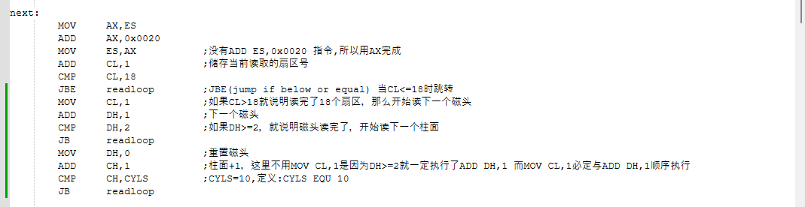

done\_folder内存储的是之前的进度

harib00x是当前的进度，在harib00x中，点击!cons\_nt.bat并输入make run后会自动编译并运行ipl.nas

如果自动打开的窗口如上，就说明运行成功了

!cons\_nt.bat支持命令可在MakeFile内查看，常用的几个有:

1.make run 自动编译并运行ipl.nas

2.make src_only 保留harib00x内的源文件，删除由make run等命令产生的其他文件

3.make install 将编译完成的ipl.img件写入磁盘中(也就是向磁盘内安装此操作系统)，需要电脑插入磁盘(软盘)，会清空软盘内原有文件

更新目录:

harib00c:目前只能读取一个磁盘第0柱面的1-18扇区。

harib00d:目前可以读取磁盘的所有柱面。
更新代码:

harib00e:制作了简单的试验系统

harib00f:可以利用启动区启动简单的试验系统

harib00g:现在启动试验系统会得到黑屏窗口，并发现了一个Makefile的bug，在输入make run时，Makefile似乎并不能很好的构建所需文件，需要输入2次make run(或已有中间文件时只需输入一次)才可运行。

已修复Makefile的bug，bug原因似乎在于Makefile文件中错误将输出的ipl10.bin输出为了ip10.bin